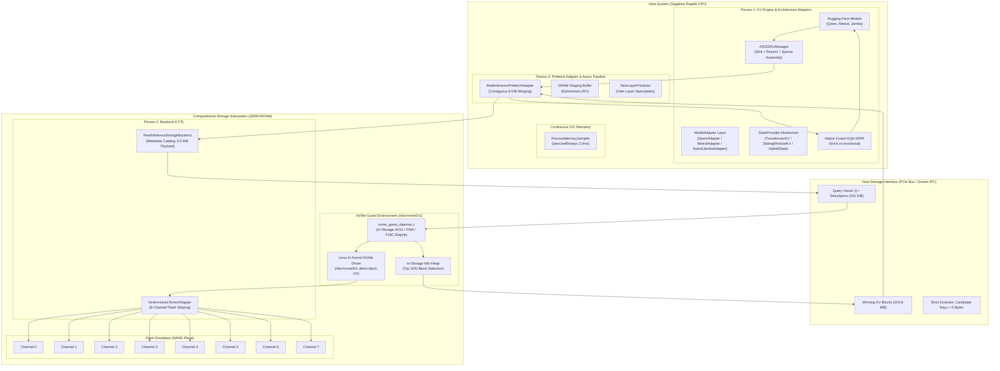
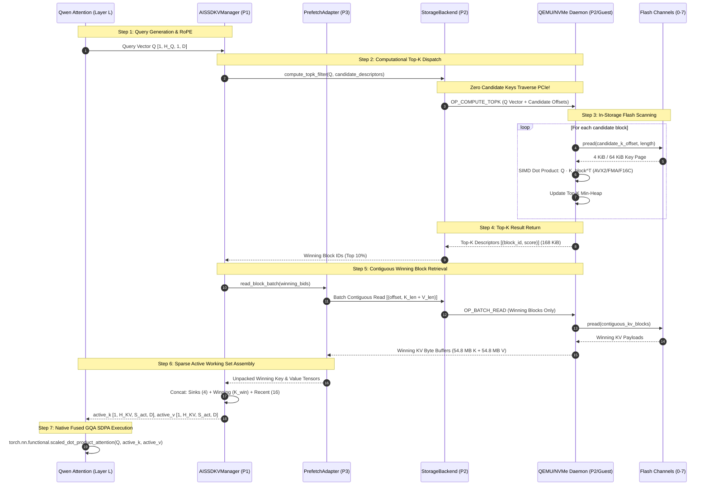
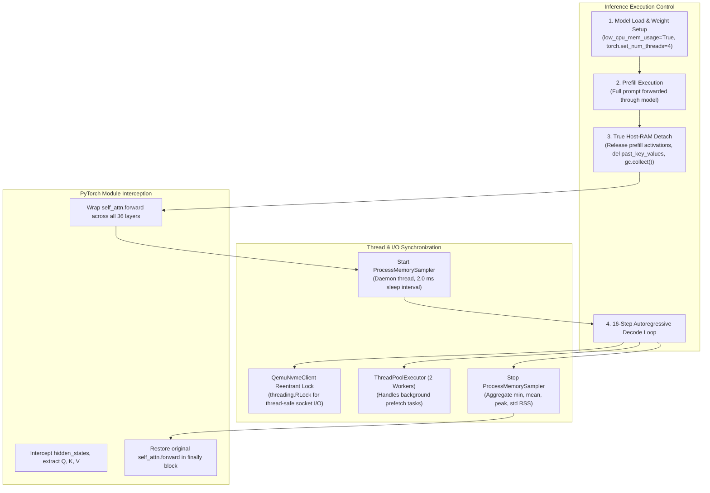
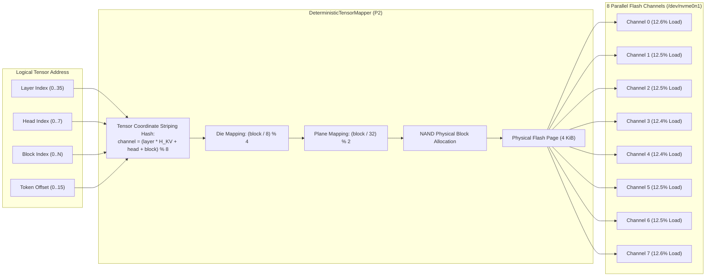

# AI-SSD V2: System Architecture

**Document Version**: 2.0 (Phase 9 Final Architecture)  
**Scope**: High-level architecture, detailed data path, control path, storage path, and model forward execution path.

---

## 1. High-Level System Architecture

AI-SSD V2 divides responsibilities across three co-designed layers: the Host Inference Engine (P1), the System Prefetch Adapter (P3), and the Computational Storage Subsystem (P2).

---

## 2. Detailed Data Path

The data path traces the flow of tensors, vectors, and raw flash blocks through the system during a single autoregressive decode step.

---

## 3. Control Path

The control path coordinates the lifecycle, synchronization primitives, thread concurrency, and telemetry tracking.

---

## 4. Storage Path & Flash Translation Layer (FTL)

The storage path maps logical tensor addresses `(layer, head, token_offset)` into physical block addresses (LBAs) and distributes them across parallel NAND channels.

### Contrast: Conventional Sequential Mapping vs Tensor-Aware FTL Mapping
- **Conventional Mapping**: Sequential blocks mapped monotonically to LBA offsets without tensor awareness. Maps an entire layer's Key blocks to a single flash channel, resulting in **700.0% load imbalance** and severe head-of-line blocking.
- **Tensor-Aware Mapping**: Strips dimensions across all 8 channels, achieving **0.86% load imbalance** and reducing the flash contention ratio from **83.26 down to 10.50**.

---

## 5. Model Execution Path

The model execution path details how a transformer decoder layer executes with sparse working-set KV retrieval.

```mermaid
flowchart TD
    subgraph TRANSFORMER_LAYER["Transformer Decoder Layer L (1 of 36)"]
        INPUT["Input Hidden States x [1, 1, D_model]"]
        LN1["Input LayerNorm (RMSNorm)"]
        QKV["QKV Projections: q_proj, k_proj, v_proj"]
        ROPE["Rotary Position Embeddings (RoPE)"]
        
        subgraph AISSD_ATTENTION["AI-SSD Intercepted Self-Attention"]
            SLIDE["Slide Recent Window: append new (k, v) token"]
            FILTER["In-Storage Top-K Filter Dispatch (Q vector only)"]
            FETCH["Retrieve Winning KV Blocks (8 KiB contiguous)"]
            CONCAT["Assemble Working Set:\n[Sinks (4)] + [Winning Top-K] + [Recent (16)]"]
            SDPA["Fused Scaled Dot-Product Attention\n(PyTorch native with enable_gqa=True)"]
            OUT_PROJ["Output Projection (o_proj)"]
        end

        RES1["Residual Add 1: x + attn_out"]
        LN2["Post-Attention LayerNorm (RMSNorm)"]
        MLP["MLP Block: gate_proj, up_proj, silu, down_proj"]
        RES2["Residual Add 2: x + mlp_out"]
        OUTPUT["Output Hidden States to Layer L+1"]
    end

    INPUT --> LN1 --> QKV --> ROPE --> SLIDE --> FILTER --> FETCH --> CONCAT --> SDPA --> OUT_PROJ --> RES1 --> LN2 --> MLP --> RES2 --> OUTPUT
```

### Overlap Opportunity During Model Forward:
While the host CPU executes the compute-heavy **Post-Attention LayerNorm** and **MLP Block** (which together consume $21.3\%$ to $22.9\%$ of total wall time), the background asynchronous thread in P3 issues the I/O read for **Layer $L+1$'s KV blocks**, effectively hiding storage latency off the critical path.
