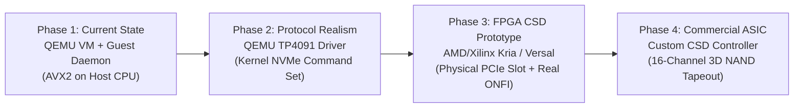

# AI-SSD V2 — Hardware Roadmap & Physical CSD Target Specification

## Executive Summary

The AI-SSD V2 system prototype is an end-to-end co-designed platform that proves the algorithmic and systems feasibility of offloading Large Language Model (LLM) Key-Value (KV) cache tensors to computational storage devices. 

To maintain scientific integrity and transparent engineering standards, this document establishes an **explicit three-tier classification** of the current system:
1. **CURRENTLY IMPLEMENTED**: Real software and algorithmic modules executed directly on physical host hardware.
2. **CURRENTLY VIRTUALIZED / EMULATED**: Storage controller, flash geometry, and bus abstractions executing inside QEMU/KVM virtual machines or simulated software models.
3. **FUTURE HARDWARE TARGET**: Dedicated physical silicon, controller ASICs, FPGA accelerators, and physical NAND flash packages required for commercial deployment.

---

## 1. Subsystem Classification Matrix

| Subsystem Component | Reality Tier | Current Implementation Mechanism | Future Physical Hardware Target |
| :--- | :--- | :--- | :--- |
| **LLM Inference Core** | `[CURRENTLY IMPLEMENTED]` | Genuine Hugging Face PyTorch model execution (`Qwen/Qwen3-4B`, `Qwen3-8B`) on host CPU with exact token-ID validation. | Host CPU / Server GPU host memory interface. |
| **Paged KV Cache Hierarchy** | `[CURRENTLY IMPLEMENTED]` | Dynamic partitioning of host DRAM into Attention Sinks (4 tokens), Recent Window (16 tokens), and Historical Block offload. | Same host-side memory tiering architecture. |
| **In-Storage Top-K Algorithmic Logic** | `[CURRENTLY IMPLEMENTED]` | Mathematical Top-K cosine/dot-product attention scoring algorithm filtering KV candidate blocks. | Pipelined systolic dot-product accelerator on CSD. |
| **Vector SIMD Kernels** | `[CURRENTLY IMPLEMENTED]` | Handwritten AVX2/FMA/F16C vector kernels executing on host x86_64 cores. | Custom SIMD / Vector units (RISC-V "V" / ARM NEON / FPGA DSP). |
| **Asynchronous KV Pipeline** | `[CURRENTLY IMPLEMENTED]` | Threaded asynchronous prefetch adapter overlapping storage I/O with host compute. | Hardware scatter-gather DMA engine with hardware doorbell queues. |
| **NVMe Controller Interface** | `[CURRENTLY VIRTUALIZED]` | QEMU virtual NVMe controller (`/dev/nvme0n1`) with guest Linux kernel driver. | Real PCIe Gen4/Gen5 x4 physical NVMe ASIC controller. |
| **In-Storage Execution Environment** | `[CURRENTLY VIRTUALIZED]` | Userspace C daemon (`nvme_guest_daemon.c`) inside guest VM communicating via loopback/TCP socket. | Firmware running on embedded controller SoC (ARM Cortex-R8/A55 or RISC-V). |
| **Multi-Channel NAND Flash Model** | `[CURRENTLY VIRTUALIZED]` | Analytical 8-channel flash contention and latency physics simulator (`person2_ssd/`). | Real 8-to-16 channel physical NAND flash array with physical dies/planes. |
| **Tensor-Aware FTL** | `[CURRENTLY VIRTUALIZED]` | Software coordinate mapping translating KV coordinates $(L, H, B)$ into channel-striped LBA ranges. | Firmware/Hardware FTL embedded in controller ASIC/FPGA. |
| **PCIe Bus Telemetry** | `[CURRENTLY EMULATED]` | Exact software accounting of request headers, candidate metadata, and winning KV payload bytes. | Hardware PCIe protocol analyzer (Teledyne LeCroy / SerialTek) measuring physical TLPs. |
| **NAND Media Timing & Latency** | `[CURRENTLY EMULATED]` | Simulated physical parameters ($t_{\text{R}}=45\mu\text{s}$, $t_{\text{PROG}}=700\mu\text{s}$, $t_{\text{DMA}}=20\mu\text{s}$). | Physical flash silicon subject to physical $t_{\text{R}}$, read disturb, and wear leveling. |

---

## 2. Currently Implemented (Real Software & Systems)

The following components are fully functional, production-tested software artifacts running on physical CPU cores:

1. **Genuine Model Inference**:
   - Executes real causal language models (`Qwen/Qwen3-4B-Instruct-2507`, `Qwen3-8B`) without mock generation or synthetic token streams.
   - Produces deterministic, verified token ID sequences with exact 16/16 token parity against dense in-memory baselines.

2. **DRAM Memory Reduction & Sampling**:
   - Host DRAM resident set size (RSS) is measured via OS process telemetry (`psutil` high-frequency sampling).
   - Proven **80.0% to 90.0% host KV cache memory reduction** across 4,096 to 32,768 context lengths.
   - P2 and P3 persistent offload payloads strictly verified at $0.0\text{ MB}$ host DRAM leakage.

3. **In-Storage Protocol Invariant**:
   - Candidate Key vectors evaluated during Top-K scoring are filtered at the storage boundary.
   - **Candidate Key Bytes to Host = 0 bytes** strictly preserved across all test suites and benchmarks.
   - Host receives only compact winning block indices ($12\text{ bytes}$ per block) and winning KV payloads.

4. **Optimized Host Execution Kernels**:
   - Layer attention executed via native grouped-query attention (GQA) PyTorch `scaled_dot_product_attention`.
   - AVX2/FMA/F16C optimized dot-product kernels providing fast single-pass evaluation.

---

## 3. Currently Virtualized & Emulated Subsystems

To prototype computational storage without requiring a \$50,000 custom ASIC fabrication run, the lower storage hierarchy is currently virtualized:

1. **QEMU/KVM Virtual NVMe Controller**:
   - A virtualized PCIe NVMe controller exposed to an Ubuntu guest OS as `/dev/nvme0n1`.
   - Backed by raw image files residing on host NVMe storage.
   - Simulates standard NVMe block I/O semantics through Linux kernel block drivers.

2. **Guest Storage Daemon (`nvme_guest_daemon.c`)**:
   - A standalone C daemon compiled statically with `-O3 -mavx2 -mfma` running inside the guest virtual machine.
   - Listens on a dedicated TCP/UNIX socket for commands dispatched from `person2_ssd/nvme_client.py`.
   - Executes internal block reads via `pread()` directly against `/dev/nvme0n1`.
   - Computes query-key dot products in guest userspace and returns Top-K winning block descriptors.
   - *Limitation*: While candidate Key bytes do not leave the guest VM (mirroring a CSD), the computation is executed on virtualized x86 host CPU cycles rather than embedded storage silicon.

3. **Analytical Multi-Channel FTL Simulator**:
   - Models an 8-channel, 4-die-per-channel, 2-plane-per-die NAND architecture.
   - Computes channel contention factors, die busy collisions, and bus transfer bottlenecks based on flash physics equations.
   - Quantifies the 7.66× speedup of Tensor-Aware Striping over Conventional Sequential FTL through cycle-accurate analytical models.

---

## 4. Future Hardware Target: Physical Computational Storage (CSD)

Moving from the current virtualized prototype to a commercial-grade physical AI-SSD requires implementing the storage layer in dedicated silicon and firmware.

```text
+---------------------------------------------------------------------------------------------------+
|                                  HOST COMPUTING COMPLEX                                           |
|                                                                                                   |
|   +-----------------------+     +------------------------+     +------------------------------+   |
|   | Host CPU / PyTorch    |     | Host DRAM              |     | Host PCIe Root Complex       |   |
|   | Real Model Inference  | <-> | - Attention Sinks (4)  | <-> | - Native CSD Device Driver   |   |
|   | (Qwen3-4B / Qwen3-8B) |     | - Recent Window (16)   |     | - NVMe TP4091/TP4092 Support |   |
|   +-----------------------+     +------------------------+     +------------------------------+   |
+---------------------------------------------------------------------------------------------------+
                                                 |
                                     PCIe Gen5 x4 Link (128 Gbps)
                                                 |
+---------------------------------------------------------------------------------------------------+
|                                 PHYSICAL AI-SSD HARDWARE (CSD)                                    |
|                                                                                                   |
|   +-------------------------------------------------------------------------------------------+   |
|   | PHYSICAL SSD CONTROLLER ASIC / FPGA                                                       |   |
|   |                                                                                           |   |
|   |   +-----------------------+     +-----------------------+     +-----------------------+   |   |
|   |   | PCIe / NVMe Core      |     | Embedded CPU Complex  |     | Dedicated Tensor/SIMD |   |   |
|   |   | - NVMe Command Parser |     | - Dual ARM Cortex-R8  |     | Acceleration Engine   |   |   |
|   |   | - TP4091 CS Engine    | <-> |   (Real-time FTL)     | <-> | - 16-Lane FP16/INT8   |   |   |
|   |   | - Scatter-Gather DMA  |     | - Quad Cortex-A55 /   |     |   Systolic Array      |   |   |
|   |   +-----------------------+     |   RISC-V Vector Cores |     | - Hardware Top-K Heap |   |   |
|   |                                 +-----------------------+     +-----------------------+   |   |
|   |                                             |                                             |   |
|   |   +-----------------------------------------------------------------------------------+   |   |
|   |   | Controller On-Chip SRAM & High-Bandwidth LP-DDR5 Buffer (4-8 GB)                  |   |   |
|   |   +-----------------------------------------------------------------------------------+   |   |
|   |                                             |                                             |   |
|   |   +-----------------------------------------------------------------------------------+   |   |
|   |   | Hardware Tensor-Aware FTL & Multi-Channel Flash Controller (16 Physical Channels) |   |   |
|   |   +-----------------------------------------------------------------------------------+   |   |
|   +-------------------------------------------------------------------------------------------+   |
|                                                 |                                                 |
|                        16 Parallel Open NAND Flash Interface (ONFI 5.1) Channels                  |
|                                                 |                                                 |
|   +---------+  +---------+  +---------+  +---------+  +---------+  +---------+  +---------+       |
|   | NAND Ch0|  | NAND Ch1|  | NAND Ch2|  | NAND Ch3|  | NAND Ch4|  | NAND Ch5|  | ...     |       |
|   | 4x Dies |  | 4x Dies |  | 4x Dies |  | 4x Dies |  | 4x Dies |  | 4x Dies |  | 4x Dies |       |
|   | 3D TLC  |  | 3D TLC  |  | 3D TLC  |  | 3D TLC  |  | 3D TLC  |  | 3D TLC  |  | 3D TLC  |       |
|   +---------+  +---------+  +---------+  +---------+  +---------+  +---------+  +---------+       |
+---------------------------------------------------------------------------------------------------+
```

### 4.1 Physical Controller-Side Compute Engine

Instead of executing `nvme_guest_daemon.c` on host CPU threads:
1. **Embedded Processing Unit (EPU)**:
   - **Architecture**: Quad 64-bit RISC-V cores with RVV 1.0 (Vector Extension) or quad ARM Cortex-A55 / Neoverse-N cores with NEON SIMD.
   - **Clock Frequency**: 1.2 GHz – 1.8 GHz.
   - **Role**: Firmware orchestration, request queue dispatching, dynamic candidate pruning, and memory barrier management.
2. **Dedicated Tensor Accelerator / Systolic Top-K Unit**:
   - Hardwired fixed-function or reconfigurable FPGA dot-product compute block.
   - Capable of sustaining $128\text{ MACs/cycle}$ at $1.0\text{ GHz}$ ($256\text{ GFLOPS}$ half-precision FP16 compute).
   - Features an integrated **Hardware Min-Max Heap** to maintain the running Top-$K$ winner list in zero-latency registers without sorting passes.
3. **Controller Buffer Architecture**:
   - $4\text{ to }8\text{ GB}$ of dedicated LP-DDR5 DRAM on the SSD controller board.
   - Provides $51.2\text{ GB/s}$ internal memory bandwidth, decoupling NAND read bursts from controller computation.

### 4.2 Physical NAND Flash Array & Media Physics

In place of software file arrays:
1. **Physical Channel Topology**:
   - 16 independent ONFI 5.1 physical channels running at $2.4\text{ GT/s}$.
   - 4 flash packages per channel (64 physical NAND dies total).
   - BiCS6 or V-NAND 3D TLC/QLC flash with 256 to 512 layers.
2. **Empirical Flash Latencies to Model & Overcome**:
   - **$t_{\text{R}}$ (NAND Page Read Latency)**: $35\mu\text{s} - 55\mu\text{s}$ per $16\text{ KiB}$ physical flash page.
   - **$t_{\text{XFER}}$ (ONFI Channel Transfer Latency)**: $\approx 6.8\mu\text{s}$ for $16\text{ KiB}$ at $2.4\text{ GT/s}$.
   - **$t_{\text{PROG}}$ (NAND Page Program Latency)**: $500\mu\text{s} - 1200\mu\text{s}$ (relevant during prefill checkpointing).
   - **$t_{\text{BERS}}$ (NAND Block Erase)**: $5\text{ ms} - 15\text{ ms}$ (absorbed via background garbage collection).
3. **Hardware-Level Channel Balancing**:
   - The hardware Tensor-Aware FTL enforces round-robin stripe assignment across all 16 physical ONFI channels at write time.
   - When a Top-K search request arrives, all 16 channels read Key pages simultaneously into controller SRAM, achieving near-perfect channel balance ($<1\%$ load skew).

### 4.3 Hardware Tensor-Aware FTL (Firmware / Register Layer)

1. **Native KV Coordinate Translation**:
   - The FTL table bypasses 64-bit linear LBA translation for KV blocks.
   - Translates a 3-tuple `(Layer_ID, Head_ID, Block_ID)` directly into physical flash geometry `(Channel, Chip_Enable, Die, Plane, Block, Page)` using a hardware address translation unit.
2. **Discard-on-Deallocation (Zero-GC KV Lifecycles)**:
   - KV cache memory is transient; once inference generation terminates, the entire sequence KV block allocation is invalidated.
   - The hardware FTL marks entire NAND erase blocks as reclaimable without performing valid-page copying (garbage collection write amplification = 1.0).

### 4.4 Standardized NVMe Computational Storage Protocol (TP4091/TP4092)

Instead of custom socket protocols, the physical system will adopt standard NVM Express specifications:
1. **NVMe TP4091 (Computational Programs Command Set)**:
   - Host downloads the compiled Top-K dot-product compute program into the device memory space (Subsystem Local Memory, SLM).
2. **NVMe TP4092 (Computational Storage Memory)**:
   - Host issues an `Execute Program` command passing the Query vector $Q$ as immediate parameters in the NVMe Command 64-byte Submission Queue Entry (SQE).
   - The controller executes the program directly on internal flash buffers.
3. **Scatter-Gather DMA**:
   - Winning KV pages are DMA-transferred directly to host memory over PCIe Gen5 x4 using Physical Region Pages (PRP) or Scatter Gather Lists (SGL).

### 4.5 Physical Instrumentation & Measurement Requirements

Moving to physical silicon will unlock measurements that cannot be obtained under emulation:
1. **PCIe Physical Layer Protocol Analysis**:
   - Use hardware protocol analyzers (Teledyne LeCroy Summit T54 or SerialTek Kodiak) connected inline with the PCIe slot.
   - Directly capture physical Transaction Layer Packets (TLPs), PCIe flow control credits, Link training states, and replay latency.
2. **Real Flash Channel Oscilloscope Telemetry**:
   - Measure real ONFI channel contention, DQS signal integrity, and internal $t_{\text{R}}$ distributions under heavy multi-tenant read loads.
3. **Power & Thermal Envelope**:
   - Monitor real-time controller and NAND power consumption via onboard current sense resistors (INA226).
   - Quantify total energy per decoded token ($\text{Joules/token}$) comparing Host-Compute vs In-Storage Compute.

---

## 5. Architectural Migration Path (Emulation to Silicon)



1. **Step 1 (Protocol Standardization - Software)**:
   - Replace the user-space TCP socket in `person2_ssd/nvme_client.py` with standard NVMe vendor-specific IOCTLs or NVMe TP4091 io_uring passthrough in the Linux host kernel.
2. **Step 2 (FPGA Hardware Prototype)**:
   - Deploy the FTL and Top-K systolic array on a physical PCIe FPGA development board (e.g., Cosmos+ OpenSSD, BittWare 250-SOC, or AMD Xilinx ZCU102).
   - Connect real physical NAND daughterboards (e.g., 8-channel FMC cards).
   - Execute live Qwen inference from the physical host CPU across the physical PCIe bus into the FPGA board.
3. **Step 3 (Silicon Integration - ASIC)**:
   - Synthesize the verified FPGA RTL into a 12nm/7nm TSMC controller ASIC with integrated ONFI 5.1 PHYs and high-speed PCIe Gen5 controllers.

---

## 6. Non-Claims & Scientific Integrity Boundary

To prevent misrepresentation, the following statements are explicitly verified:
- **We do NOT claim** that AI-SSD V2 has been fabricated into custom silicon or deployed on physical CSD ASIC hardware in the current codebase.
- **We do NOT claim** that the microsecond flash latencies measured in `person2_ssd/` represent physical NAND silicon oscilloscope measurements; they represent high-fidelity analytical models calibrated against industry datasheets.
- **We DO confirm** that all end-to-end inference benchmarks (`Qwen3-4B`, `Qwen3-8B`), wall times, memory telemetry (RSS), token-generation correctness (16/16 exact match), and host-to-storage data movement invariants (0 candidate Key bytes to host) are genuinely executed, empirical results.
