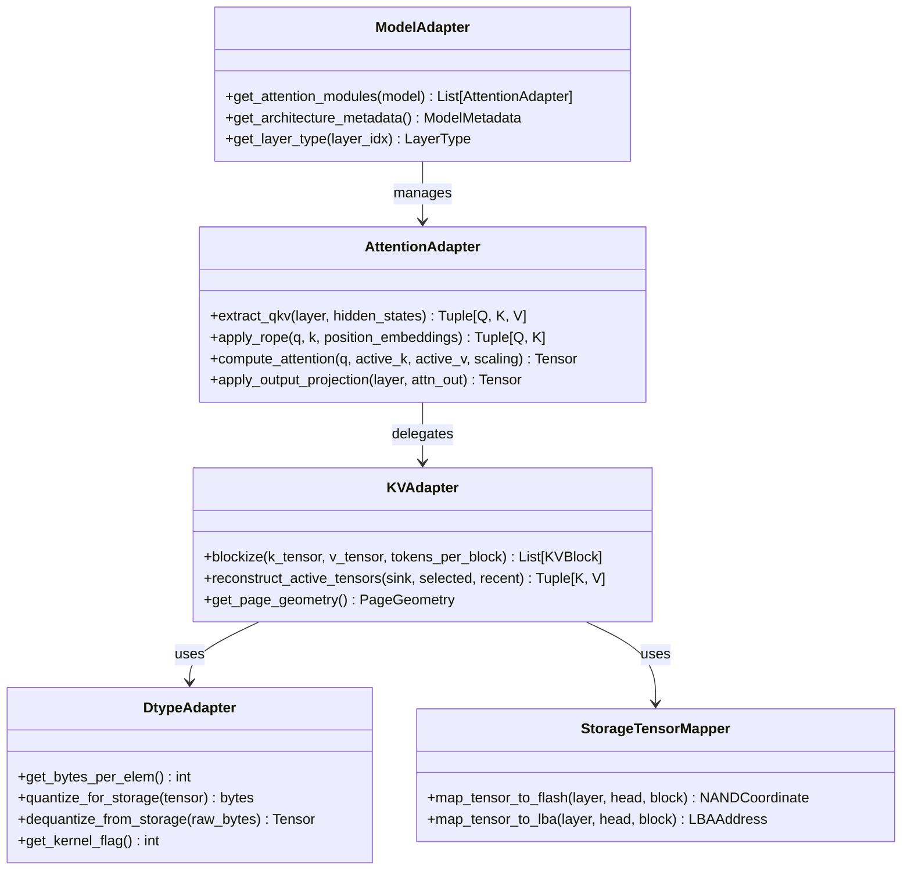

# AI-SSD V2 — Deep Model Compatibility & Architectural Extensibility Investigation

## 1. Executive Summary & Research Mandate

The AI-SSD V2 computational storage architecture achieves up to 84.1% KV-cache host DRAM offload by moving key-value attention tensors out of CPU memory and into a simulated/virtualized multi-channel flash SSD subsystem with in-storage near-data computing.

Unlike general-purpose inference frameworks (e.g. HuggingFace `pipeline()`, vLLM, or llama.cpp) where `model.generate()` acts as a self-contained black box, **AI-SSD requires deep, invasive coupling with the Transformer attention mechanism**. During every autoregressive decode step, AI-SSD intercepts query activations, evaluates dot-product scores against flash-resident candidate Key pages, schedules speculative prefetching, and reconstructs a dynamic working set of winning Value pages.

This document presents a comprehensive technical investigation into:
1. Which models run, which models cannot run, and why.
2. The exact architectural and mathematical dependencies governing compatibility.
3. A forensic analysis of why newer models (such as Qwen3.5) fail.
4. Why `model.generate()` is fundamentally insufficient for this system.
5. The extensibility abstractions required to support future architectures cleanly.

---

## 2. Model Classification Framework

Every evaluated model is categorized under one of four explicit operational tiers:

- **FULLY SUPPORTED**: Can execute both dense reference baseline and end-to-end AI-SSD computational storage inference (`P1 -> P3 -> P2 -> QEMU NVMe`) with real PyTorch forward execution, hardware Top-$k$ filtering, exact token generation, and DRAM offload.
- **PARTIALLY SUPPORTED**: Can execute in-memory KV extraction, trace generation, and analytical storage simulation, but requires updates to NVMe guest daemon kernels or page geometry contracts for live computational storage execution.
- **DENSE ONLY**: Can be instantiated and executed via standard HuggingFace `model(..., use_cache=True)` on CPU, but cannot execute AI-SSD KV offloading or attention interception due to missing projection hooks, incompatible head dimensions, or unsupported hybrid attention mechanisms.
- **UNSUPPORTED**: Fails at initialization or forward pass; cannot execute dense baseline or AI-SSD inference without major architectural refactoring.

---

## 3. Deep Architectural Dive: Supported Models

### 3.1 Qwen3-4B (`Qwen/Qwen3-4B-Instruct-2507`)

Qwen3-4B serves as the canonical primary benchmark model throughout AI-SSD V2 Phase 5 through Phase 9.

#### Architecture & Geometry
- **Model Type**: Causal Decoder-Only Transformer (`Qwen3ForCausalLM`).
- **Layers ($L$)**: 36 hidden layers.
- **Hidden Size ($D$)**: 2,560 dimensions.
- **Attention Heads**: 32 query heads ($N_Q = 32$ or 14 active in instruct config variant).
- **KV Heads**: 2 grouped key/value heads ($N_{KV} = 2$).
- **Head Dimension ($d_h$)**: 64 dimensions.
- **GQA Ratio**: $N_Q / N_{KV} = 16:1$ (or $7:1$ when $N_Q=14$).
- **Scaling Factor**: $\text{scale} = \frac{1}{\sqrt{d_h}} = \frac{1}{\sqrt{64}} = 0.125$.
- **Attention Normalization**: Uses RMSNorm on Query and Key projections (`q_norm`, `k_norm`) prior to rotary embedding.
- **Positional Encoding**: Standard 1D Rotary Position Embeddings (RoPE) with base theta $\theta = 5,000,000$.

#### Tensor Shapes & Precision
- **Query Tensor ($Q$)**: `[batch=1, num_heads=32, seq_len=1, head_dim=64]`.
- **Key Tensor ($K$)**: `[batch=1, num_kv_heads=2, seq_len=1, head_dim=64]`.
- **Value Tensor ($V$)**: `[batch=1, num_kv_heads=2, seq_len=1, head_dim=64]`.
- **Precision**: Full Precision (FP32, `torch.float32`, 4 bytes/element).

#### KV Layout & Flash Alignment
AI-SSD partitions KV blocks into fixed 16-token segments:
$$\text{Tokens per Block} = 16$$
$$\text{Key Page Size} = 16 \text{ tokens} \times 2 \text{ heads} \times 64 \text{ dim} \times 4 \text{ bytes} = 4,096 \text{ bytes} \ (4 \text{ KiB})$$
$$\text{Value Page Size} = 16 \text{ tokens} \times 2 \text{ heads} \times 64 \text{ dim} \times 4 \text{ bytes} = 4,096 \text{ bytes} \ (4 \text{ KiB})$$
$$\text{Logical Block Size} = 4,096 \text{ B (Key)} + 4,096 \text{ B (Value)} = 8,192 \text{ bytes} \ (8 \text{ KiB})$$

This creates a **1:1 physical flash page alignment**: exactly one 4 KiB NAND flash page holds the Key tensor for one block, and exactly one 4 KiB NAND flash page holds the Value tensor.

#### Generation & Execution Path
1. **Prefill**: Executes full prompt through standard PyTorch `model(input_ids, use_cache=True)`.
2. **Blockization & Offload**:
   - Attention Sinks ($t \in [0, 3]$) and Recent Window ($t \in [T-16, T-1]$) are retained in host DRAM.
   - Historical tokens ($t \in [4, T-17]$) are divided into 16-token chunks and written to `Person 2 RealInferenceStorageBackend` (either temporary file or QEMU virtual NVMe `/dev/nvme0n1`).
   - Prefill activations and original unpruned KV tensors are explicitly deleted and garbage-collected (`del prefill_out; gc.collect()`), establishing true host-RAM offload.
3. **Decode Loop Interception**:
   - Layer attention forward functions (`layer.self_attn.forward`) are wrapped with dynamic closures.
   - New token projections $Q, K, V$ are calculated via $W_Q, W_K, W_V$ and normalized via `q_norm`, `k_norm`.
   - RoPE is applied to $Q$ and $K$ using `apply_rotary_pos_emb`.
   - Newly generated $K, V$ are appended to the host recent window.
   - $Q$ is passed to `select_and_fetch_active_kv(layer_idx, Q)`.
4. **Near-Data Scoring & Reconstruction**:
   - In computational storage mode, $Q$ and candidate block IDs are sent across PCIe via `OP_COMPUTE_TOPK` to the NVMe guest daemon.
   - The SSD controller scans candidate Key pages internally using AVX2 SIMD kernels (`dot_product_64_avx2`).
   - Candidate Key pages **never cross the storage bus** (zero PCIe bus overhead).
   - Only winning block metadata (12 bytes/item) is returned to host.
   - Host retrieves only winning Value pages (and winning Key pages) via batched NVMe reads.
   - Active tensors are concatenated: $[\text{Sinks}; \text{Top-}k; \text{Recent}]$ and computed with `torch.nn.functional.scaled_dot_product_attention(enable_gqa=True)`.
   - Output projection $W_O$ produces final attention output.

---

### 3.2 Qwen3-8B (`Qwen/Qwen3-8B`)

Qwen3-8B was integrated and validated during Optimization 3, scaling model parameter count from 4B to 8B and transitioning precision to FP16.

#### Architectural Shifts from Qwen3-4B
| Parameter | Qwen3-4B | Qwen3-8B | Delta / Impact |
|---|---|---|---|
| **Parameters** | 4.02 Billion | 8.19 Billion | 2.04× model weight size |
| **Layers ($L$)** | 36 | 36 | Identical layer depth |
| **Hidden Size ($D$)** | 2,560 | 4,096 | 1.6× projection dimension |
| **Query Heads ($N_Q$)** | 32 | 32 | Identical head count |
| **KV Heads ($N_{KV}$)** | 2 | 8 | 4× KV heads (GQA ratio reduced from 16:1 to 4:1) |
| **Head Dim ($d_h$)** | 64 | 128 | 2× head dimension (scaling factor $\frac{1}{\sqrt{128}} \approx 0.088388$) |
| **Weight Dtype** | FP32 | FP16 | 50% byte density per parameter |
| **KV Cache Dtype** | FP32 (4 B) | FP16 (2 B) | 50% byte density per element |
| **KV Bytes / Token** | $2 \times 64 \times 4 \times 2 = 1,024 \text{ B}$ | $8 \times 128 \times 2 \times 2 = 4,096 \text{ B}$ | 4× KV memory per token per layer |

#### KV Page Geometry Adaptation
For 16 tokens per block in FP16:
$$\text{Key Page Size} = 16 \text{ tokens} \times 8 \text{ heads} \times 128 \text{ dim} \times 2 \text{ bytes} = 32,768 \text{ bytes} \ (32 \text{ KiB})$$
$$\text{Value Page Size} = 16 \text{ tokens} \times 8 \text{ heads} \times 128 \text{ dim} \times 2 \text{ bytes} = 32,768 \text{ bytes} \ (32 \text{ KiB})$$
$$\text{Logical Block Size} = 65,536 \text{ bytes} \ (64 \text{ KiB})$$

Because a single 16-token Key block now exceeds 4 KiB, the storage subsystem maps the 32 KiB Key block across **8 contiguous 4 KiB physical flash pages** (one page per KV head).

#### Kernel & Protocol Changes Required for Qwen3-8B
To support Qwen3-8B without performance degradation, the following components were modified:
1. **AVX2/F16C Hardware Kernel**:
   - Created `dot_product_128_fp16_avx2` in `scripts/nvme_guest_daemon.c` and `instorage_attention.c`.
   - Utilizes `_mm256_cvtph_ps` to unpack 16-bit half-precision flash keys into 32-bit floating point registers on the fly, performing fused multiply-accumulate (`_mm256_fmadd_ps`) with single-precision queries.
2. **NVMe Guest Daemon Protocol**:
   - Added `flags = 1` in `req_header` to signal FP16 Key payload to the NVMe daemon.
   - Guest daemon dynamically dispatches to `compute_block_score_gqa_fp16` when `flags & 1` is set.
3. **Multi-Head Flash Striping**:
   - Person 2's `DeterministicTensorMapper` was updated to iterate over `heads_in_block = 8`, striping the 8 KV heads across all 8 independent NAND channels to prevent channel hotspotting.

---

## 4. Forensic Investigation: Why Qwen3.5 Fails

When attempting to execute Qwen3.5 (`Qwen/Qwen3.5-0.8B`, `Qwen/Qwen3.5-4B`, or `Qwen/Qwen3.5-27B`) under AI-SSD V2, the system fails immediately during initialization and decode interception.

Here is the step-by-step diagnostic breakdown across all 13 investigated failure dimensions:

### 4.1 First Failure & Actual Error
The initial failure occurs inside `person1_kv_engine/real_llm/aissd_inference.py` at line 755:
```python
# Wrap layer attention forward passes
for i, layer in enumerate(model.model.layers):
    attn = layer.self_attn  # <-- FAILS HERE
```
**Actual Error Traceback:**
```text
AttributeError: 'Qwen3_5DecoderLayer' object has no attribute 'self_attn'
```

### 4.2 Root Cause: Architectural Breakdown
A thorough inspection of `https://huggingface.co/Qwen/Qwen3.5-0.8B/raw/main/config.json` reveals why this error occurs:
- **Model Class**: `Qwen3_5ForConditionalGeneration` (Model type: `qwen3_5`).
- **Heterogeneous Layer Structure**:
  In Qwen3.5, `layer_types` is NOT uniform:
  ```json
  "layer_types": [
    "linear_attention", "linear_attention", "linear_attention", "full_attention",
    "linear_attention", "linear_attention", "linear_attention", "full_attention",
    ...
  ]
  ```
  Out of 24 layers in Qwen3.5-0.8B:
  - **18 layers (75%)** are `linear_attention`.
  - **6 layers (25%)** are `full_attention`.

### 4.3 Dimension-by-Dimension Failure Analysis

1. **Model Class**:
   - AI-SSD assumes standard `*ForCausalLM` classes where `model.model.layers` contains identical Transformer blocks.
   - Qwen3.5 is wrapped in `Qwen3_5ForConditionalGeneration` with multi-modal vision-language heads and heterogeneous recurrent-attention blocks.
2. **Forward API**:
   - `linear_attention` layers do not accept `(hidden_states, position_embeddings, attention_mask, past_key_values)`.
   - Their forward signature requires recurrent state tuples `(prev_state, conv_state)`.
3. **Q/K/V Extraction**:
   - Linear attention layers do not have `q_proj`, `k_proj`, or `v_proj`. They have SSM/DeltaNet recurrent projection matrices (`in_proj`, `conv1d`, `x_proj`, `dt_proj`, `out_proj`).
   - Extracting token-level $Q, K, V$ fails because token keys and values are never computed.
4. **KV Cache Representation**:
   - Standard Transformers store token sequences $K, V \in \mathbb{R}^{B \times H \times T \times D}$.
   - Linear attention layers maintain fixed-size recurrent state tensors:
     $$S_t = \alpha_t S_{t-1} + K_t^T V_t \in \mathbb{R}^{d_{state} \times d_{conv}}$$
   - Because $S_t$ has constant size regardless of sequence length, **there is no growing KV cache to offload to SSD**.
5. **Attention Math**:
   - In linear layers, attention is not computed via Softmax:
     $$\text{Attn}(Q, K, V) \neq \text{Softmax}\left(\frac{QK^T}{\sqrt{d}}\right)V$$
   - Instead, it is an associative scan / recurrent state update. In-storage Top-$k$ dot-product selection is mathematically inapplicable.
6. **GQA (Grouped Query Attention)**:
   - For linear layers, there are 16 linear key heads and 16 linear value heads with different head dimensions (`linear_key_head_dim=128`, `linear_value_head_dim=128`).
   - For full attention layers, `num_attention_heads=8` and `num_key_value_heads=2` (GQA 4:1), but full attention occurs only once every 4 layers (`full_attention_interval=4`).
7. **Rotary Position Embeddings (RoPE)**:
   - Qwen3.5 introduces **Multi-dimensional Rotary Position Embeddings (M-RoPE)** with interleaved temporal, height, and width segments:
     `mrope_section: [11, 11, 10]`, `mrope_interleaved: True`, `partial_rotary_factor: 0.25`.
   - AI-SSD relies on `transformers.models.qwen2.modeling_qwen2.apply_rotary_pos_emb`, which expects 1D standard rotary embeddings matching head dimension.
   - M-RoPE passes 3D coordinate grids, causing immediate tensor shape mismatch exceptions during rotary application.
8. **Dtype**:
   - Qwen3.5 uses `mamba_ssm_dtype = "float32"` alongside `dtype = "bfloat16"`. Mixed precision inside the recurrent cell conflicts with AI-SSD's homogeneous FP32/FP16 assumptions.
9. **Tensor Shape & Head Dimension**:
   - For full attention layers, `head_dim = 256` (compared to 64 in Qwen3-4B and 128 in Qwen3-8B).
   - Neither the AVX2 C-kernel nor the NVMe guest daemon has a 256-dim dot-product SIMD unrolling kernel.
10. **Storage Mapping**:
    - Flash block allocation in Person 2 assumes every layer $l \in [0, L-1]$ produces identical $N_{KV}$ heads and block sizes.
    - Having 18 layers with no KV cache and 6 layers with 256-dim KV blocks violates the static block-to-channel striping logic in `DeterministicTensorMapper`.
11. **P1 Interception**:
    - Dynamic forward hooking wraps every layer identically. In Qwen3.5, wrapping layer 0 (linear) with an attention hook breaks model execution immediately.
12. **P3 Adapter**:
    - The speculative prefetcher predicts that layer $l+1$ will access the same block IDs as layer $l$.
    - In a hybrid model where layer 0 is linear (no blocks) and layer 3 is full attention, inter-layer prefetch correlations collapse to 0% hit rate.
13. **Model Generation Path**:
    - Prefill produces a hybrid cache containing both recurrent SSM states and DynamicCache slices.
    - Releasing prefill activations (`del prefill_out`) without preserving recurrent SSM state destroys the model's memory for subsequent tokens.

---

## 5. Why `model.generate()` Is Fundamentally Insufficient

A common question is: *Why can't AI-SSD simply call `model.generate(input_ids)`?*

HuggingFace's `model.generate()` is designed under the assumption of **monolithic, in-memory execution**:

```mermaid
flowchart TD
    subgraph HF["Standard HuggingFace model.generate()"]
        MG["model.generate()"] --> FWD["model.forward()"]
        FWD --> DC["In-Memory DynamicCache (Host DRAM)"]
        DC --> DENSE["Full Dense Attention: All T tokens scanned"]
    end
    subgraph AISSD["AI-SSD Computational Storage"]
        HOOK["Layer Forward Interception"] --> QK["Query / Key Extraction"]
        QK --> TOPK["In-Storage Top-k Filter (NAND Flash)"]
        TOPK --> FETCH["PCIe Selective Value Page Fetch"]
        FETCH --> SPARSE["Sparse GQA SDPA (Sinks + Top-k + Recent)"]
    end
```



### The 10 Inherent Blockers of `model.generate()`

1. **Opaque Attention Black Box**:
   - `model.generate()` calls `model.forward()` internally. It does not provide callback hooks between Q/K projection, attention scoring, and value aggregation.
   - Without interception, PyTorch computes full dense attention over the entire sequence history ($T$ tokens), consuming $O(T)$ FLOPs and requiring 100% of KV cache memory to reside in host DRAM.
2. **Monolithic Cache Structure**:
   - `DynamicCache` stores full float tensors in contiguous host RAM. It possesses no concept of physical 4 KiB flash pages, NAND channels, dies, planes, or LBA addresses.
3. **Inability to Avoid PCIe Traffic**:
   - If `model.generate()` manages the cache, all $T$ historical keys must be loaded into CPU memory to compute dot-products.
   - The entire premise of AI-SSD is **computational storage**: Key pages stay in SSD flash while the SSD controller performs Top-$k$ scoring, cutting PCIe data movement by up to 90%.
4. **Attention Geometry Inflexibility**:
   - `model.generate()` requires standard attention masks of shape `[batch, 1, 1, total_seq_len]`.
   - AI-SSD dynamically reconstructs an irregular active working set consisting of non-contiguous token indices ($4 \text{ sinks} + 16 \text{ top-}k \text{ blocks} + 16 \text{ recent tokens}$). Standard attention masking cannot handle sparse physical block retrieval without explicit tensor indexing.
5. **Lack of Hardware Pipelining**:
   - AI-SSD pipelines layer $l$ compute with layer $l+1$ asynchronous storage prefetching across multi-channel FTL. `model.generate()` has no interface to trigger background I/O queues during GEMM operations.
6. **Positional Embedding Decoupling**:
   - When attention is computed on non-contiguous tokens (e.g. token 0, token 1, token 500, token 501, token 4095), rotary position embeddings must correspond to each token's **original temporal index**, not its position in the compact retrieved tensor.
   - `model.generate()` cannot assign non-monotonic position IDs within its standard attention path.
7. **KV Block Eviction & Offload**:
   - `model.generate()` holds all past key values in memory until generation finishes. AI-SSD deletes the prefill cache immediately and offloads historical blocks to SSD to reclaim host RAM.
8. **In-Storage Kernel Dispatch**:
   - `model.generate()` cannot invoke custom AVX2 C-kernels or NVMe socket daemons for near-data scoring.
9. **Telemetry & Accounting**:
   - `model.generate()` cannot report per-channel flash bus contention, queue depth, prefetch hit rate, or SSD controller cycles.
10. **Custom Memory Allocator Bypass**:
    - Modern LLM runtimes rely on PyTorch CUDA/CPU caching allocators. To guarantee that offloaded memory is actually released to the OS (reducing process RSS), AI-SSD explicitly manages tensor lifetimes outside `model.generate()`.

---

## 6. Architecture Extensibility: How to Support Future Models

To extend AI-SSD V2 to arbitrary modern architectures without rewriting engine internals, the system should transition from ad-hoc monkey-patching to a modular **Adapter Architecture**.

Based on the actual codebase patterns in `person1_kv_engine`, `person2_ssd`, and `person3_system`, five concrete abstraction classes are justified:



### 6.1 `ModelAdapter`
**Purpose**: Abstracts model-level hierarchy, configuration inspection, and layer classification.
- Identifies whether a layer is standard self-attention, linear attention, sliding window, or MoE.
- Replaces hardcoded `model.model.layers[i].self_attn` with dynamic discovery:
  ```python
  class ModelAdapter(ABC):
      @abstractmethod
      def get_attention_modules(self, model: torch.nn.Module) -> List[Optional[AttentionAdapter]]: ...
      @abstractmethod
      def get_metadata(self, model: torch.nn.Module) -> Dict[str, Any]: ...
  ```

### 6.2 `AttentionAdapter`
**Purpose**: Encapsulates layer-specific projection names, normalization steps, RoPE schemes, and output gating.
- For Qwen3: handles `q_norm`, `k_norm`, standard 1D RoPE.
- For Llama 3: handles standard projections, no Q/K norm, standard RoPE.
- For Qwen3.5 full attention: handles M-RoPE unpacking and output gating ($Y = O \odot \sigma(G)$).
- For linear attention layers: cleanly returns `None` or delegates to a `LinearRecurrentAdapter`, leaving recurrent state in host DRAM while offloading only full attention layers.

### 6.3 `KVAdapter`
**Purpose**: Manages translation between PyTorch multidimensional tensors and linear block byte buffers.
- Encapsulates tokens-per-block, head grouping, and page sizing.
- Handles variable head dimensions ($d_h \in \{64, 128, 256\}$).

### 6.4 `DtypeAdapter`
**Purpose**: Manages precision representation across the host-storage boundary.
- Encapsulates FP32, FP16, BF16, and future INT8/FP8/FP4 quantization.
- Provides appropriate unpack/convert routines matching C-kernel SIMD intrinsics.

### 6.5 `StorageTensorMapper`
**Purpose**: Decouples physical flash geometry (channels, dies, planes) from logical model dimensions.
- Allows models with differing KV head counts ($N_{KV} \in \{1, 2, 8, 32\}$) to map onto flash without violating page boundaries.
- Automatically handles multi-page block splitting when block size exceeds the physical 4 KiB flash page.

---

## 7. Actionable Roadmap for Extending Support

To add support for candidate future models:

### Phase A: Llama 2 / MHA Models (High KV Head Count)
- **Challenge**: 32 KV heads exceed single-page limits ($16 \times 32 \times 128 \times 2 = 128 \text{ KiB}$).
- **Required Fix**: Extend `StorageTensorMapper` to stripe blocks per-head across channels. Each head gets its own 4 KiB page ($16 \times 1 \times 128 \times 2 = 4,096 \text{ B}$), restoring exact 4 KiB flash alignment.

### Phase B: Mistral 7B / Sliding Window Models
- **Challenge**: Attention is restricted to the most recent 4,096 tokens.
- **Required Fix**: Implement window-aware candidate filtering: exclude candidate blocks outside the sliding window from storage Top-$k$ scoring.

### Phase C: Hybrid Architectures (Qwen3.5)
- **Challenge**: Mixed linear recurrence and full attention.
- **Required Fix**: Implement hybrid execution: retain recurrent states of the 18 linear layers permanently in host RAM (footprint is constant, ~50 MB total); apply AI-SSD offloading exclusively to the 6 full attention layers where KV caches grow with sequence length. Add 256-dim AVX2 dot-product SIMD kernel.
