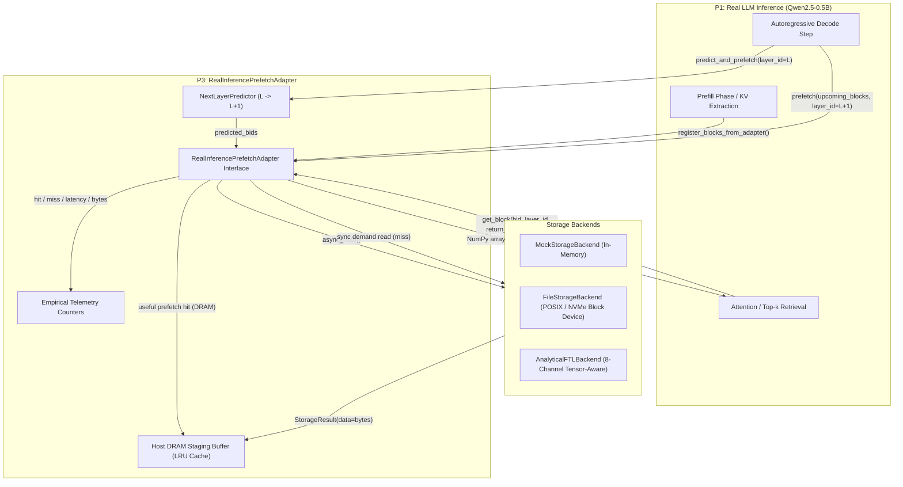

# P3 Real Inference Prefetch Adapter (`RealInferencePrefetchAdapter`)

**Phase**: 5C — Real Inference Prefetch Adapter  
**Author**: Person 3 (P3 — System Integration / Storage API / Prefetch / Experiments)  
**Status**: APPROVED & VERIFIED (37/37 Tests Passing)  
**Target Consumer**: Person 1 (P1 — Real LLM / KV Engine)

---

## 1. Executive Summary

`RealInferencePrefetchAdapter` exposes the AI-SSD V2 storage prefetch subsystem directly to real LLM inference loops (e.g. Qwen2.5-0.5B running under P1).

### Core Capabilities
1. **Speculative Pre-Staging**: Issues asynchronous, non-blocking storage read requests for upcoming KV blocks into a host DRAM staging buffer before the attention kernel requires them.
2. **Actual KV Block Data Retrieval**: Returns real tensor slices (NumPy `np.ndarray` of shape `[kv_heads, tokens, head_dim]`) or raw byte payloads (4,096 bytes Key page, 4,096 bytes Value page, or 8,192 bytes combined logical block).
3. **Rigorous Metric Accounting**: Tracks demand reads, prefetch requests, useful prefetches, late prefetches, useless prefetches, byte transfers, and elapsed latencies.
4. **Zero Artificial Latency**: Never inserts artificial delays or `time.sleep()`. Operates at native Python/C/OS hardware speeds.
5. **Event-Driven Execution**: Completely driven by the inference loop's step/layer calls with **zero** reliance on analytical 620.88 tok/s models.
6. **Backend Agnostic**: Fully interoperable with `FileStorageBackend` (direct disk/NVMe), `MockStorageBackend` (in-memory deterministic testing), and `AnalyticalFTLBackend` (multi-channel tensor-aware FTL).

---

## 2. System Architecture



---

## 3. Callable Interface Specification for P1

Module: `person3_system.prefetch` (or `person3_system.prefetch.inference_adapter`)  
Primary Class: `RealInferencePrefetchAdapter`

### 3.1 Constructor

```python
RealInferencePrefetchAdapter(
    storage_backend: Optional[StorageBackend] = None,
    buffer_capacity_blocks: int = 512,
    bytes_per_block: int = 8192,
    tokens_per_block: int = 16,
    kv_heads_per_block: int = 1,
    head_dim: int = 64,
    dtype: str = "FP32",
)
```

- **`storage_backend`**: Underlying storage backend instance. Defaults to `MockStorageBackend()` if omitted.
- **`buffer_capacity_blocks`**: Maximum number of KV blocks staged in host DRAM (default 512 blocks = 4 MiB for 8 KiB blocks).
- **`bytes_per_block`**: Total logical block size (default 8,192 bytes = 4,096 B Key + 4,096 B Value).
- **`tokens_per_block`**: Tokens per KV block (default 16).
- **`head_dim`**: Attention head dimension (default 64 for Qwen2.5-0.5B).
- **`dtype`**: Tensor data type `"FP32"`, `"FP16"`, or `"FP8"`.

---

### 3.2 Block Registration Methods

#### `register_block(...)`
Stores an individual KV block into the storage backend:
```python
def register_block(
    self,
    block_id: int,
    layer_id: int,
    head_id: int = 0,
    payload: Optional[Union[bytes, Dict[str, np.ndarray], np.ndarray]] = None,
    token_start: int = 0,
    stage_in_dram: bool = False,
    **kwargs,
) -> StorageResult
```
- **`payload`**: Accepts:
  - `{"k": np.ndarray, "v": np.ndarray}` (recommended for P1 KV tensors).
  - Raw `bytes` (automatically padded to `bytes_per_block` if smaller).
  - Flat/reshaped `np.ndarray`.
- **`stage_in_dram`**: If `True`, immediately puts the block into the host DRAM buffer.

#### `register_blocks_from_adapter(...)`
Batch helper consuming output directly from P1's `KVBlockAdapter.blockize_layer()`:
```python
def register_blocks_from_adapter(
    self,
    layer_blocks: List[Tuple[KVBlock, Dict[str, np.ndarray]]],
    stage_in_dram_if_tier: bool = False,
) -> int
```
- Ingests all `(KVBlock, {"k": k_slice, "v": v_slice})` tuples into storage. Returns the total count of blocks registered.

---

### 3.3 Speculative Prefetch Methods

#### `prefetch(...)` / `prefetch_blocks(...)`
Issues speculative, non-blocking prefetch reads to storage:
```python
def prefetch(
    self,
    block_ids: List[int],
    layer_id: int,
    head_id: int = 0,
    **kwargs,
) -> List[int]
```
- Dispatches background I/O via `storage_backend.async_read()`.
- Evicts oldest unaccessed blocks via LRU if buffer capacity is reached (accounting them as `useless_prefetches` and `wasted_bytes`).
- Returns the list of block IDs dispatched for prefetch.

#### `predict_and_prefetch(...)`
Predicts next layer blocks using inter-layer attention locality and dispatches prefetch:
```python
def predict_and_prefetch(
    self,
    current_layer_id: int,
    current_block_ids: List[int],
    stride: int = 0,
) -> Tuple[int, List[int]]
```
- Returns `(next_layer_id, prefetched_block_ids)`.

---

### 3.4 Demand Retrieval Methods

#### `get_block(...)`
Demands an actual KV block for attention computation:
```python
def get_block(
    self,
    block_id: int,
    layer_id: int,
    head_id: int = 0,
    sub_page: str = "BOTH",
    return_tensors: bool = False,
    **kwargs,
) -> Union[bytes, Dict[str, np.ndarray], np.ndarray]
```
- **`sub_page`**:
  - `"KEY"`: Returns 4,096-byte Key page (or `[kv_heads, tokens, head_dim]` array if `return_tensors=True`).
  - `"VALUE"`: Returns 4,096-byte Value page (or `[kv_heads, tokens, head_dim]` array if `return_tensors=True`).
  - `"BOTH"`: Returns 8,192-byte combined block (or `{"k": k_arr, "v": v_arr}` if `return_tensors=True`).
- **Hit Semantics**:
  - **Useful Prefetch Hit**: Block was prefetched and I/O completed. Returns immediately from host DRAM.
  - **Late Prefetch**: Block was prefetched but I/O is still in-flight. Awaits I/O completion and records `late_prefetches += 1`.
  - **Demand Miss**: Block was never prefetched. Dispatches synchronous read to storage backend and records `demand_misses += 1`.

#### `get_blocks(...)`
Batch demand retrieval convenience method:
```python
def get_blocks(
    self,
    block_ids: List[int],
    layer_id: int,
    head_id: int = 0,
    sub_page: str = "BOTH",
    return_tensors: bool = False,
) -> Dict[int, Union[bytes, Dict[str, np.ndarray], np.ndarray]]
```

---

### 3.5 Telemetry & Reset Methods

#### `get_telemetry()` / `get_metrics()`
Returns complete dictionary of empirical metrics:
```python
{
    "demand_reads": int,
    "demand_hits": int,
    "demand_misses": int,
    "demand_hit_rate": float,        # [0.0, 1.0]
    "demand_hit_rate_pct": float,    # [%]
    "prefetch_requests": int,
    "useful_prefetches": int,
    "late_prefetches": int,
    "useless_prefetches": int,
    "prefetch_accuracy": float,      # [0.0, 1.0]
    "prefetch_accuracy_pct": float,  # [%]
    "demand_bytes": int,
    "prefetched_bytes": int,
    "useful_bytes": int,
    "wasted_bytes": int,
    "total_bytes": int,
    "total_latency_us": float,
    "avg_latency_us": float,
    "demand_hit_avg_latency_us": float,
    "demand_miss_avg_latency_us": float,
    "buffer_capacity_blocks": int,
    "current_staged_blocks": int,
    "current_memory_bytes": int,
    "peak_memory_bytes": int,
    "storage_backend": dict,
}
```

---

## 4. Mathematical Definitions of Metrics

| Metric | Formula | Description |
| :--- | :--- | :--- |
| **Demand Reads** | $N_{\text{demand}} = N_{\text{hit}} + N_{\text{miss}}$ | Total blocks requested by the inference engine |
| **Demand Hit Rate** | $R_{\text{hit}} = \frac{N_{\text{hit}}}{N_{\text{demand}}}$ | Ratio of requested blocks found in DRAM staging |
| **Prefetch Accuracy** | $A_{\text{pref}} = \frac{N_{\text{useful}}}{N_{\text{pref\_req}}}$ | Ratio of prefetched blocks actually consumed |
| **Late Prefetches** | $N_{\text{late}} = \sum [t_{\text{demand}} < t_{\text{ready}}]$ | Blocks requested while storage I/O was in-flight |
| **Useless Prefetches** | $N_{\text{useless}} = N_{\text{evicted\_unused}} + N_{\text{buffer\_unaccessed}}$ | Blocks prefetched that were never read by inference |
| **Wasted Bytes** | $B_{\text{wasted}} = N_{\text{useless}} \times S_{\text{block}}$ | Storage bandwidth spent on unread speculative data |
| **Average Latency** | $\bar{L} = \frac{\sum L_{\text{hit}} + \sum L_{\text{miss}}}{N_{\text{demand}}}$ | Mean wall-clock latency per demand read |

---

## 5. End-to-End P1 Integration Example

```python
import numpy as np
from person1_kv_engine.real_llm.block_adapter import KVBlockAdapter
from person3_system.prefetch import RealInferencePrefetchAdapter
from person3_system.storage.file_backend import FileStorageBackend

# 1. Initialize Storage Backend & Prefetch Adapter
backend = FileStorageBackend(filepath="/opt/ai-ssd-v2/images/v2_nvme.raw", block_size=8192)
adapter = RealInferencePrefetchAdapter(
    storage_backend=backend,
    buffer_capacity_blocks=512,  # 4 MiB DRAM staging
    tokens_per_block=16,
    head_dim=64,
    dtype="FP32",
)

# 2. Ingest Prefilled KV Cache Blocks (e.g. from P1 KVBlockAdapter)
block_adapter = KVBlockAdapter(tokens_per_block=16, head_dim=64, dtype="FP32")
# all_layer_blocks = block_adapter.blockize_all_layers(layer_kv)
# for layer_id, blocks in all_layer_blocks.items():
#     adapter.register_blocks_from_adapter(blocks)

# 3. Autoregressive Decode Loop (Layer-by-Layer Overlap)
num_layers = 24
for step in range(max_new_tokens):
    for layer_id in range(num_layers):
        # A. Speculatively prefetch upcoming layer (L+1) blocks
        next_layer = (layer_id + 1) % num_layers
        predicted_blocks = [10, 11, 12]  # from attention predictor or previous step
        adapter.prefetch(block_ids=predicted_blocks, layer_id=next_layer)

        # B. Retrieve actual KV block tensors for current layer (Useful Hit from DRAM!)
        current_blocks = [10, 11]
        for bid in current_blocks:
            kv_tensors = adapter.get_block(
                block_id=bid,
                layer_id=layer_id,
                sub_page="BOTH",
                return_tensors=True,
            )
            k_tensor = kv_tensors["k"]  # np.ndarray [1, 16, 64] float32
            v_tensor = kv_tensors["v"]  # np.ndarray [1, 16, 64] float32

            # Compute attention...

# 4. Extract Empirical Telemetry at End of Inference
telemetry = adapter.get_telemetry()
print(f"Demand Hit Rate: {telemetry['demand_hit_rate_pct']}%")
print(f"Prefetch Accuracy: {telemetry['prefetch_accuracy_pct']}%")
print(f"Late Prefetches: {telemetry['late_prefetches']}")
print(f"Wasted Bytes: {telemetry['wasted_bytes']} bytes")

adapter.close()
```

---

## 6. Verification & Test Suite

The adapter is verified by 10 comprehensive unit and integration tests in `tests/test_inference_prefetch_adapter.py`:

```bash
pytest tests/test_inference_prefetch_adapter.py -v
```

All 37 test cases across P3 pass with 100% success rate:
- `person3_system/tests/test_experiment_runner.py`: 2 passed
- `person3_system/tests/test_p3_integration.py`: 6 passed
- `person3_system/tests/test_p3_mock_pipeline.py`: 2 passed
- `person3_system/tests/test_storage_backend.py`: 5 passed
- `person3_system/tests/test_trace_reader.py`: 5 passed
- `person3_system/tests/test_v2_integration_stages.py`: 2 passed
- `person3_system/tests/test_v2_prefetcher.py`: 2 passed
- `tests/test_end_to_end_real_pipeline.py`: 2 passed
- `tests/test_phase3_eval.py`: 1 passed
- `tests/test_inference_prefetch_adapter.py`: 10 passed
